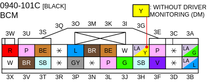
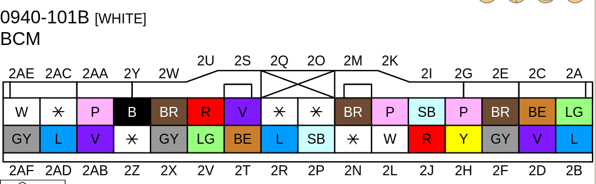

# Mazda CX-30 CAN hacking
Welcome, this repository serves as my notebook regarding reverse engineering Mazda CX-30 (2019 series, Skyactiv-X, EU model).

## Architectural overview
A couple of things that are important to know from the start:
 - Most (all?) CAN buses are connected to the BCM
 - There is no CAN traffic on OBD connector, I'm not yet sure if traffic from that port is "firewalled"
 - The amount of traffic on the main buses is huge, Raspberry Pi with MCP2515 module can barely handle the traffic on one bus (TODO: check if the code can be optimized?)
 - There are no unique message IDs that would correlate to simple things like "lights toggled", so reversing the communication is a pain.
 
 ### Vehicle CAN
 Bus called "Vehicle CAN" connects following components:
  - BCM (Body Control Module)
  - EPS (Electric Power Steering)
  - Headlights auto levelling controller
  - SAS control module (airbags)
  - Electronically controlled brake unit
  - TCM (Transmission Control Module) - for AT models only
  - PCM (Powertrain Control Module) - ECU
Be really careful when messing with this bus :)
On BCM side, it's connected to the connector 0940-101C (black one, towards the door), pins 3W (CAN_L) and 3X (CAN_H). It runs on 500kbaud.

### Body CAN
Body CAN bus connects following components:
 - BCM
 - Front and rear lights
 - Climate control unit
 - Steering lock unit
 - Steering angle sensor
 - Instrument cluster
 - HUD ("Active driving display")
 - LF control unit (Keyless entry / immobilizer)
 - Door supply unit (one for passenger and one for driver side)
 - Dash electrical supply unit
 - Power liftgate control module
 - Shift panel (for AT models)
 - Electrical supply unit
 On BCM side, it's connected to the connector 0940-101B (large white one, on the face of the unit - towards inside of the car), pins 2J (CAN_L) and 2L (CAN_H). It runs on 500kbaud.
 

 ### Other buses
-  There's a separate CAN bus for parking sensors (connects BCM, electrical supply unit and front/rear parking sensors).
- There's a separate bus for cameras (connecting BCM, forward sensing camera, driver monitoring camera and 360° camera).
 - There's a separate bus for front radar sensor (that is actually connected to the BCM twice, for some reason).
- There's a bus connecting BCM to the CMU (connectivity master unit - infotainment) and audio amplifier.
- The eCall system is also connected to the BCM via CAN bus.
 - And finally, there's a CAN bus for m-Hybrid system, that connects m-Hybrid battery, NOx sensor (optionally), brake unit, DC-DC converter, ISG (integrated starter generator), and PCM.

## Accessing the connectors the easy way

 1. Lift up the long plastic cover on the bottom of the driver side door
 2. Gently move away the door seal (it slides in on the lip of the chassis to expose the plastic latches on the module under the dash
 3. The BCM is under the cover that has a removable piece as a fusebox cover.
 4. The cover is held in place towards the front by one pin. Remove it using a flathead screwdriver.

## Scripts
These scripts generally assume you have a can interface available on your computer and `can-utils` installed. If not, you can use `vcan` driver to experiment with dumps stored elsewhere.
### canview.py
This script shows communitaction in realtime, hilighting changes. It requires python-can installed.

Usage: `./canview.py can0`

### dumpsender.sh and vcan-setup.sh
I use these to setup development environment on my computer. `vcan-setup.sh` creates two vcan interfaces and links them together (and requires root/sudo). `dumpsender.sh` the reads dump generated by candump and sends it to the specified bus. 

For example: `./dumpsender.sh can0-idle-engon-liftgate-opening.txt 0.01 vcan0` will read the text file, and writes a frame to `vcan0`  every `0.01` seconds. Then I can use `./canview.py vcan1` to see the emulated traffic. 
TODO: I'll upload the script that's also able to read timestamped dumps once I'll get to my car to test it.

##  Frames
[frames-common.md](frames-common.md) is a list of frame IDs that are common on both body and vehicle bus.

[frames-vehicle.md](frames-vehicle.md) are vehicle bus only (common are excluded)

[frames-body.md](frames-body.md) are body bus only (common are excluded)

## Other resources
https://github.com/majbthrd/MazdaCANbus/blob/master/skyactiv.kcd
https://www.mazda3revolution.com/threads/canbus-messages.225538/
